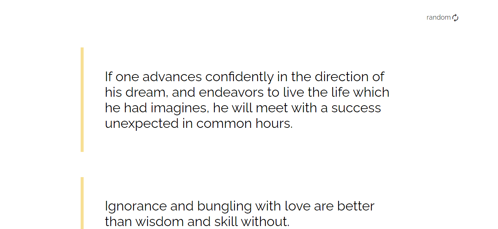

# Quote Generator

Solution for the **Random Quote Generator** challenge from <a href="https://devchallenges.io/challenges/8Y3J4ucAMQpSnYTwwWW8" target="_blank">Devchallenges.io</a>.

<!-- TABLE OF CONTENTS -->

## Table of Contents

- [Challenge](#challenge)
- [Solution](#solution)
  - [Demo](#demo)
  - [Built With](#built-with)
- [How to Use](#how-to-use)
- [Acknowledgements](#acknowledgements)

<!-- Challenge -->

## Challenge

Challenge: Create a quote generator app. Use Front-end libraries like React or Vue.
Fulfill user stories below:

- User story: I can see a random quote
- User story: I generate a new random quote
- User story: When I select quote author, I can see a list of quotes from them
- User story: I can see quote genre under the author

<!-- Solution -->

## Solution

### Demo

_Find the site in action [here]()!_




### Built With

<!-- This section should list any major frameworks that you built your project using. Here are a few examples.-->

- [React](https://reactjs.org/)

## How To Use

<!-- For example: -->

To clone and run this application, you'll need [Git](https://git-scm.com) and [Node.js](https://nodejs.org/en/download/) (which comes with [npm](http://npmjs.com)) installed on your computer. From your command line:

```bash
# Clone this repository
$ git clone https://github.com/your-user-name/your-project-name

# Install dependencies
$ npm install

# Run the app
$ npm start
```

## Acknowledgements

- [How To Make A Loader](https://www.w3schools.com/howto/howto_css_loader.asp)
